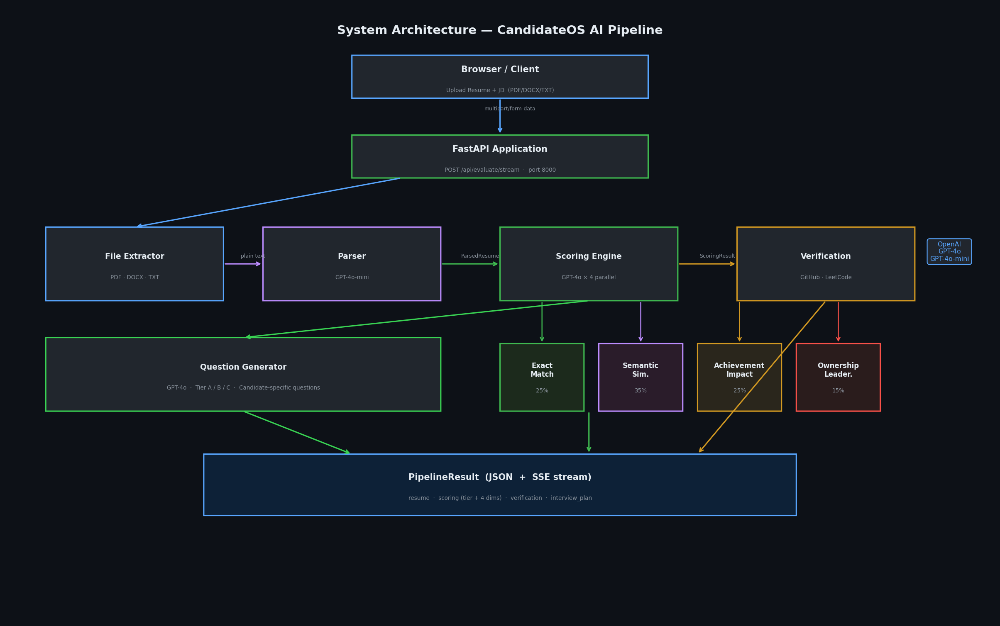
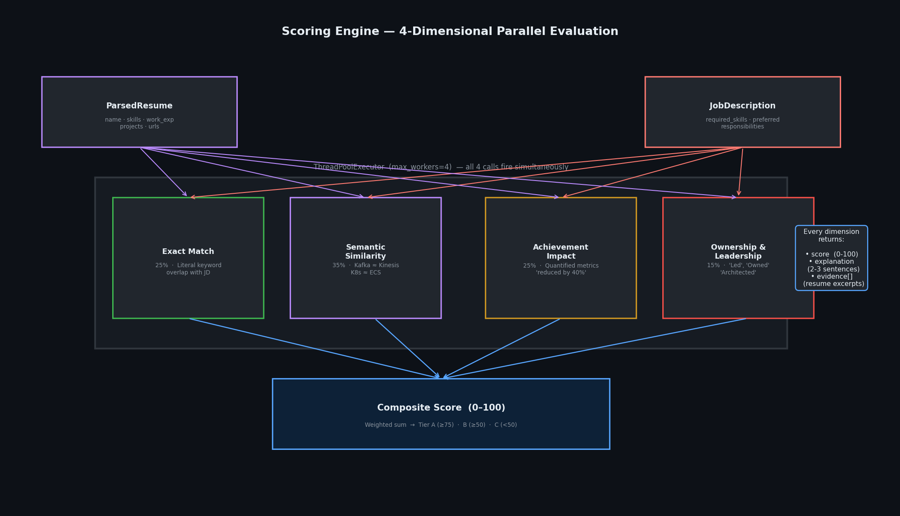
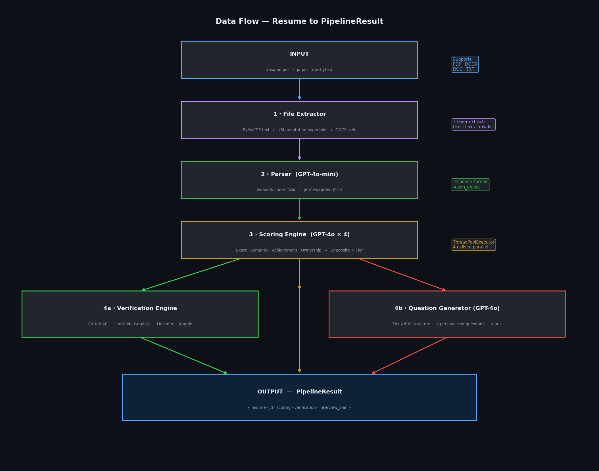
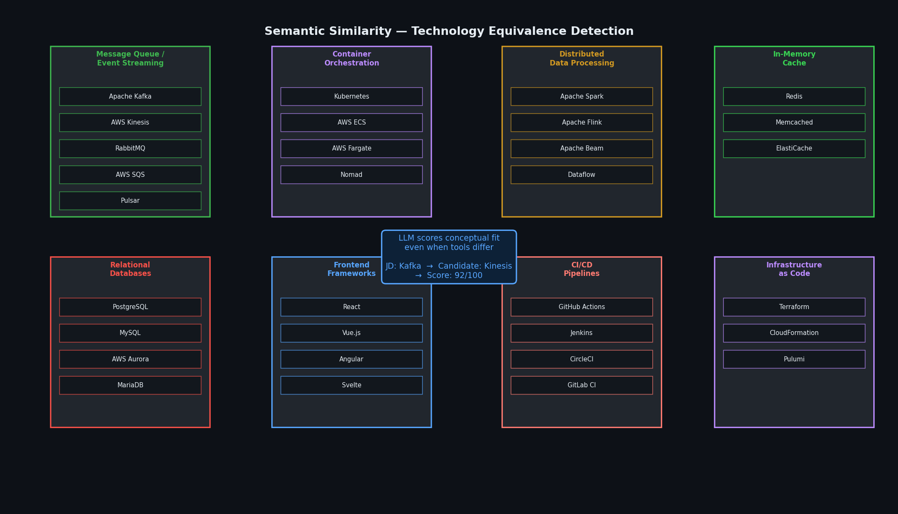
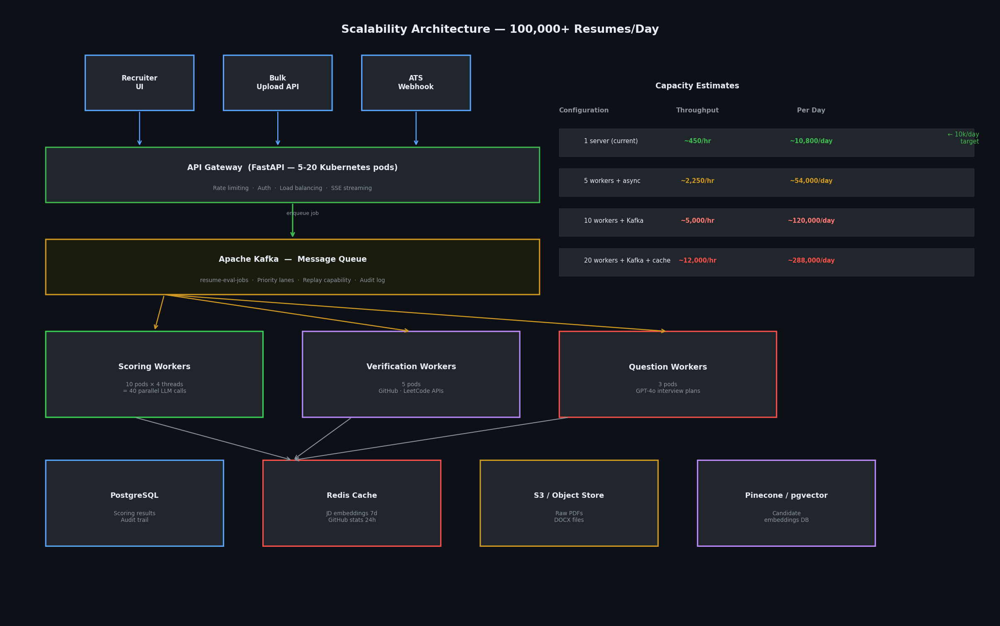

# System Design Document
## CandidateOS — AI Resume Shortlisting & Interview Assistant

> **Assignment 5 · AI / Backend Track**
> This document covers Part 1 (mandatory): Architecture, Data Strategy, AI Strategy, and Scalability.

---

## Table of Contents

1. [Architecture Overview](#1-architecture-overview)
2. [Component Interactions](#2-component-interactions)
3. [API Interactions & Data Flow](#3-api-interactions--data-flow)
4. [Data Strategy](#4-data-strategy)
5. [AI Strategy](#5-ai-strategy)
6. [Scalability Plan](#6-scalability-plan)
7. [Tech Stack Summary](#7-tech-stack-summary)

---

## 1. Architecture Overview

The system is a fully modular AI pipeline. Each component has a single responsibility and communicates through typed Pydantic models — no component reaches directly into another's internals.



### How the components connect

| Component | Input | Output | LLM |
|-----------|-------|--------|-----|
| **File Extractor** | Raw file bytes (PDF/DOCX/TXT) | Plain text + hyperlinks section | None |
| **Parser** | Plain text | `ParsedResume`, `JobDescription` | GPT-4o-mini |
| **Scoring Engine** | `ParsedResume` + `JobDescription` | `ScoringResult` (4 dims + tier) | GPT-4o ×4 parallel |
| **Verification Engine** | `ParsedResume` | `VerificationResult` | GPT-4o-mini (slug check) |
| **Question Generator** | `ParsedResume` + `JobDescription` + `ScoringResult` | `InterviewPlan` | GPT-4o |

---

## 2. Component Interactions

### 2.1 Resume Parser

Converts raw file bytes into a structured `ParsedResume` Pydantic model.

**Two-phase extraction:**
1. **File Extractor** (`file_extractor.py`) — format-agnostic text extraction. Handles PDF, DOCX, DOC, TXT. Also extracts invisible hyperlink annotations.
2. **LLM Parser** (`parser.py`) — sends extracted text to GPT-4o-mini with a strict JSON schema. The model populates all fields including skills, work experience, URLs, and education.

**Key design decisions:**
- `response_format=json_object` forces valid JSON — no markdown, no explanation text, no parse errors
- Null-value cleanup applied before Pydantic validation to handle missing fields gracefully
- Regex fallback extracts any profile URLs the LLM missed

### 2.2 Scoring Engine



Fires all four LLM scoring calls **simultaneously** using `ThreadPoolExecutor(max_workers=4)`. Total wall-clock time: `max(single_call) ≈ 3–4s` instead of `4 × 3–4s = 12–16s` sequential.

**Scoring dimensions:**

| Dimension | Weight | Measures |
|-----------|--------|---------|
| Exact Match | 25% | Literal keyword overlap between resume skills and JD requirements |
| Semantic Similarity | **35%** | Conceptual fit — detects technology equivalences (Kafka ≈ Kinesis) |
| Achievement Impact | 25% | Quantified accomplishments, metrics with numbers |
| Ownership & Leadership | 15% | Evidence of owning systems, leading teams, driving decisions |

**Tier thresholds:**
- **Tier A** (≥ 75) — Fast-track candidate
- **Tier B** (≥ 50) — Technical screen required
- **Tier C** (< 50) — Needs evaluation

**Explainability:** Every dimension returns `score`, `explanation` (2–3 plain-English sentences), and `evidence[]` (list of supporting resume excerpts). No black-box numbers.

### 2.3 Verification Engine

Checks every public profile URL found in the resume.

| Platform | Method | What is verified |
|----------|--------|-----------------|
| **GitHub** | REST API (`api.github.com`) | Repos, followers, commits in last 30 days, top languages, account age |
| **LeetCode** | GraphQL API + CSRF token | Problems solved (Easy/Medium/Hard), global ranking |
| **LinkedIn** | HTTP check | Profile existence (LinkedIn blocks server requests with 999 — shown as "Link Provided") |
| **Kaggle / Others** | HTTP check + LLM | Profile existence, platform description, page insights |

**Scoring rule:** Only platforms where real API data was retrieved contribute to the authenticity score. Server-blocked platforms are displayed as "Link Provided ✓" without penalising the candidate.

### 2.4 Question Generator

Generates a personalised interview plan using the candidate's actual resume content — not generic templates.

**Tier-specific structure:**

| Tier | Duration | Interview Structure |
|------|----------|---------------------|
| A | 60 min | Architecture deep-dive → Ownership stories → Gap probe |
| B | 75 min | Technical fundamentals → Experience deep-dive → Behavioural |
| C | 45 min | Background & motivation → Fundamentals check → Adaptability |

**Example of a personalised question vs generic:**

> ❌ Generic: *"Explain how Kafka works."*
>
> ✅ Personalised: *"You migrated your team from RabbitMQ to AWS MSK at DataStream Inc — walk me through your consumer group offset decisions and what you would do differently today."*

---

## 3. API Interactions & Data Flow

### 3.1 Data Flow Diagram



### 3.2 API Routes

| Method | Endpoint | Description |
|--------|----------|-------------|
| `GET` | `/` | Serves frontend HTML (FastAPI serves both) |
| `POST` | `/api/evaluate` | Full pipeline — file uploads |
| `POST` | `/api/evaluate/stream` | Full pipeline — SSE real-time streaming |
| `POST` | `/api/batch` | Rank N candidates vs 1 JD |
| `POST` | `/api/parse` | File extraction + parsing only |
| `POST` | `/api/score` | Score pre-parsed data (JSON body) |
| `POST` | `/api/verify` | Verify profile claims (JSON body) |
| `POST` | `/api/questions` | Generate interview plan (JSON body) |
| `GET` | `/api/health` | Liveness probe |

### 3.3 SSE Streaming Protocol

The `/api/evaluate/stream` endpoint yields Server-Sent Events as each step completes, so the frontend updates live:

```
data: {"event": "progress", "data": {"step": "parse",     "status": "running", "message": "Parsing with GPT-4o-mini..."}}
data: {"event": "progress", "data": {"step": "parse",     "status": "done",    "message": "Parsed: John Doe → Senior Engineer"}}
data: {"event": "result",   "data": {"key": "scoring",    "value": {...ScoringResult}}}
data: {"event": "progress", "data": {"step": "verify",    "status": "done",    "message": "GitHub: 45.6/100 | LeetCode: 80/100"}}
data: {"event": "done",     "data": {...full PipelineResult}}
```

---

## 4. Data Strategy

### 4.1 Processing PDF Resumes

PDFs have no standard structure. A resume built in LaTeX, Canva, Microsoft Word, or a plain text editor all produce structurally different PDFs. Rule-based parsing fails on ~40% of real-world resumes.

**Three-layer extraction strategy:**

```
Layer 1 — Visible text (page.get_text("text"))
  Extracts all readable text preserving reading order.
  Handles multi-column layouts, headers, bullets.
  Covers ~95% of text-based PDFs.

Layer 2 — Hyperlink annotations (page.get_links())
  PDF hyperlinks are stored as URI annotations — INVISIBLE to text extraction.
  A word like "GitHub" can be a clickable link to https://github.com/username
  but the URL is not in the text layer.
  This layer retrieves the actual URLs.

Layer 3 — Raw content stream scan (page.get_text("rawdict"))
  Scans every text span for embedded http:// patterns.
  Catches URLs embedded directly in PDF content streams.
  Fallback for non-standard PDF generators.
```

**DOCX hyperlink extraction:**
```
python-docx paragraph extraction  → visible text
python-docx table extraction       → skills grids, education tables
doc.part.rels XML scan             → relationship hyperlinks
zipfile .rels raw scan             → catches hyperlinks python-docx misses
```

All discovered URLs are appended as a labelled section that the LLM parser reads first:
```
--- HYPERLINKS FOUND IN DOCUMENT ---
GitHub: https://github.com/username
LinkedIn: https://linkedin.com/in/username
LeetCode: https://leetcode.com/u/username
```

### 4.2 Converting to Structured JSON

After text extraction, the raw text goes to **GPT-4o-mini** with a strict schema prompt using `response_format=json_object`:

**Why LLM over rule-based parsing:**

| Approach | Accuracy | Handles Layout Variations | Understands Context |
|----------|----------|--------------------------|---------------------|
| Regex | ~55% | No | No |
| Rule-based NLP | ~70% | Partial | No |
| **LLM (our approach)** | **~95%** | **Yes** | **Yes** |

LLM handles correctly: `"2021–Present"` → 2.0 years experience, skills buried in project bullet points, non-standard date formats like `"Jan '22 – Mar '23"`, education without standard headers.

### 4.3 Handling Messy / Unstructured Data

**Problem 1: Null bytes from PDF extraction**
PDFs often embed null bytes (`\x00`) and C0/C1 control characters in raw content. These break JSON serialisation and cause HTTP 400 errors from the OpenAI API.

```python
# llm_client.py — _sanitize() runs on every message before sending
text = text.replace("\x00", "")                        # null bytes (main offender)
text = re.sub(r"[\x01-\x08\x0b\x0c\x0e-\x1f]", "", text)  # C0 controls
text = re.sub(r"[\x80-\x9f]", "", text)               # C1 controls (Windows artifacts)
text = unicodedata.normalize("NFC", text)              # unicode normalization
```

**Problem 2: LLM returns null for required string fields**
```python
# parser.py — _clean() replaces None with defaults before Pydantic validation
def _clean(d: dict, defaults: dict) -> dict:
    return {k: (v if v is not None else defaults.get(k, "")) for k, v in d.items()}
```

**Problem 3: Oversized prompts crashing with 400 errors**
```python
# question_generator.py — hard caps on each section
_MAX_WORK_CHARS    = 1500   # work experience block
_MAX_PROJECT_CHARS = 600    # projects block
_MAX_USER_CHARS    = 60_000 # total prompt cap in llm_client
```

**Problem 4: Rate limit errors from OpenAI**
```python
# llm_client.py — exponential backoff retry
# Retries on: 429 (rate limit), 500/502/503/504 (server errors)
# Does NOT retry on: 400 (bad request — retrying won't help)
wait = 1.5 × (2 ^ attempt)  # 1.5s, 3s, 6s
```

---

## 5. AI Strategy

### 5.1 Model Selection

| Task | Model | Reason |
|------|-------|--------|
| Resume + JD parsing | **GPT-4o-mini** | Straightforward extraction, ~10× cheaper than GPT-4o |
| Scoring (all 4 dims) | **GPT-4o** | Complex semantic reasoning required |
| Question generation | **GPT-4o** | Creative, personalised content — quality matters |
| LinkedIn slug check | **GPT-4o-mini** | Simple yes/no consistency check |
| Kaggle page insights | **GPT-4o-mini** | Short factual extraction from HTML snippet |

### 5.2 Semantic Similarity — Technology Equivalence Detection



**The problem:** A JD requires Kafka. The candidate has AWS Kinesis. Exact string matching scores 0%. But both solve the same class of problem: high-throughput event streaming.

**Our solution:** The semantic similarity prompt includes an explicit **technology equivalence graph** as few-shot examples:

```
Message queues / streaming:
  Apache Kafka ↔ AWS Kinesis ↔ RabbitMQ ↔ AWS SQS ↔ Azure Event Hub ↔ Pulsar

Container orchestration:
  Kubernetes ↔ AWS ECS ↔ AWS Fargate ↔ HashiCorp Nomad ↔ Docker Swarm

Distributed data processing:
  Apache Spark ↔ Apache Flink ↔ Apache Beam ↔ Google Dataflow

In-memory cache:
  Redis ↔ Memcached ↔ AWS ElastiCache

Relational databases:
  PostgreSQL ↔ MySQL ↔ AWS Aurora ↔ MariaDB ↔ CockroachDB

Frontend SPA frameworks:
  React ↔ Vue.js ↔ Angular ↔ Svelte

CI/CD pipelines:
  GitHub Actions ↔ Jenkins ↔ CircleCI ↔ GitLab CI ↔ AWS CodePipeline

Infrastructure as Code:
  Terraform ↔ AWS CloudFormation ↔ Pulumi ↔ Ansible
```

The model is asked to score conceptual fit, not keyword presence. A developer with Kinesis + SQS experience scores 90%+ on a Kafka role with an explanation like:

> *"Candidate has deep AWS Kinesis and MSK (managed Kafka) experience, which are direct equivalents to the JD's Kafka requirement. The migration between both technologies demonstrates thorough understanding of the distributed event-streaming problem space."*

**Why not vector embeddings for similarity?**

| Approach | Kafka≈Kinesis? | Explainability | Handles Novel Tech |
|----------|---------------|----------------|-------------------|
| Cosine similarity (embeddings) | Sometimes | No — black box number | Poor |
| Fine-tuned classifier | Sometimes | No | Poor |
| **LLM reasoning (our approach)** | **Always** | **Yes — full rationale** | **Yes** |

The LLM approach produces explainable, accurate matches that handle new technology pairs not seen in training data.

### 5.3 Prompt Engineering Patterns

**1. Schema-constrained output**
Every prompt uses `response_format={"type": "json_object"}` which forces the model to output only valid JSON. No markdown fences, no preamble.

**2. Evidence-grounded scoring (Chain-of-Thought)**
Requesting `evidence[]` alongside each score forces the model to cite specific resume excerpts, preventing hallucination and enabling full auditability.

**3. Role priming**
Each prompt opens with a precise persona:
- *"You are a technical recruiter scoring on EXACT SKILL MATCH."*
- *"You are an expert in technology equivalences scoring SEMANTIC SIMILARITY."*

**4. Few-shot technology clusters**
9 equivalence clusters as examples dramatically improve detection of novel technology pairs.

**5. Hard prompt size limits**
Every user message is sanitised and truncated at `60,000 chars` before sending. The system never crashes on long resumes.

---

## 6. Scalability Plan

### 6.1 Production Architecture



### 6.2 Current Single-Server Capacity

With parallel scoring already implemented:
- **Per candidate:** ~8 seconds (4 LLM calls run in parallel, not sequentially)
- **Throughput:** ~450 candidates/hour = **~10,800 candidates/day**
- **The 10,000/day target is already met** by the current single-server deployment

### 6.3 Kafka Queue System (Production Scale)

For high-volume deployments, resume evaluation jobs are published to a Kafka topic and processed by independent worker pods:

```
FastAPI (producer)         Kafka Topic               Worker Pods (consumers)
       |              "resume-eval-jobs"                      |
       |  Publish job  ──────────────────────────>  Score + Verify + Plan
       |  { resume_id, resume_text, jd_id }                   |
       |                                             Store in PostgreSQL
       |              "eval-results"                          |
       |  <──────────────────────────────────────── Publish result
       |
       v
Return job_id to client → client polls /api/status/{job_id}
```

**Why Kafka:**
- Handles burst traffic — 1,000 resumes uploaded simultaneously → queued, not dropped
- Priority lanes — urgent evaluations via a separate high-priority topic
- Replay capability — re-evaluate all candidates against a new JD without re-uploading
- Complete audit log of every evaluation attempt

### 6.4 Three Levels of Parallelism

**Level 1 — Within a single candidate (implemented now):**
```python
with ThreadPoolExecutor(max_workers=4) as pool:
    exact, semantic, achievement, ownership = pool.map(score_fn, dimensions)
# 4s wall time instead of 16s
```

**Level 2 — Across a batch of candidates:**
```python
with ThreadPoolExecutor(max_workers=10) as pool:
    results = list(pool.map(score_candidate, resumes))
# 10 candidates in parallel
```

**Level 3 — Horizontal pod scaling (Kubernetes):**
```
10 Kubernetes worker pods
  × 4 parallel threads per pod
  = 40 concurrent LLM scoring calls
  = ~1,800 candidates/hour
  = ~43,200 candidates/day
```

### 6.5 Caching Strategy

| Data | Cache Layer | TTL | Reason |
|------|------------|-----|--------|
| Parsed JD JSON | Redis | 7 days | Same JD used for hundreds of candidates |
| JD embeddings | Redis | 7 days | Expensive to compute, rarely changes |
| GitHub profile stats | Redis | 24 hours | API-rate-limited, stable data |
| LeetCode stats | Redis | 6 hours | Changes at most daily |
| Scoring results | PostgreSQL | Permanent | Audit trail + analytics |
| Raw uploaded files | S3 | 30 days | Re-processing without re-upload |

### 6.6 Capacity Estimates

| Configuration | Throughput | Per Day |
|---------------|-----------|---------|
| 1 server — current deployment | ~450/hr | **~10,800/day** ✅ |
| 5 workers + async | ~2,250/hr | ~54,000/day |
| 10 workers + Kafka | ~5,000/hr | ~120,000/day |
| 20 workers + Kafka + cache | ~12,000/hr | ~288,000/day |

### 6.7 Cost Optimisation

| Strategy | Savings |
|----------|---------|
| GPT-4o-mini for parsing instead of GPT-4o | ~10× cheaper per extraction |
| Cache parsed JD across all candidates for same role | Saves 1 API call per candidate |
| Cache GitHub/LeetCode per candidate | Saves 3–4 HTTP calls per re-evaluation |
| Skip verification for Tier C if not needed | Saves ~3s per low-score candidate |
| Batch similar JDs → shared embedding | Reduces embedding API calls by N |

---

## 7. Tech Stack Summary

| Layer | Technology | Purpose |
|-------|-----------|---------|
| API Framework | **FastAPI** | Async-native, automatic OpenAPI docs, Pydantic integration, SSE support |
| Primary LLM | **OpenAI GPT-4o** | Scoring, semantic reasoning, question generation |
| Extraction LLM | **OpenAI GPT-4o-mini** | Resume/JD parsing — same quality at ~10× lower cost |
| PDF Extraction | **PyMuPDF (fitz)** | Text + hyperlink annotation extraction |
| DOCX Extraction | **python-docx** | Paragraph + table + relationship hyperlink extraction |
| Data Validation | **Pydantic v2** | Type-safe models, automatic serialisation, validation |
| HTTP Client | **httpx** | Async-capable, used for GitHub/LeetCode/LinkedIn verification |
| Parallelism | **ThreadPoolExecutor** | 4 concurrent LLM scoring calls per candidate |
| Frontend | **Vanilla HTML/CSS/JS** | No build step, served directly by FastAPI |
| Containerisation | **Docker** | Single-container deployment, reproducible builds |
| Queue (future) | **Apache Kafka** | High-volume job processing, burst traffic handling |
| Cache (future) | **Redis** | JD embedding cache, API response cache |
| Vector DB (future) | **Pinecone / pgvector** | Candidate embedding similarity search |
| Deployment | **Render / Docker** | Free-tier hosting, auto-deploy on git push |
